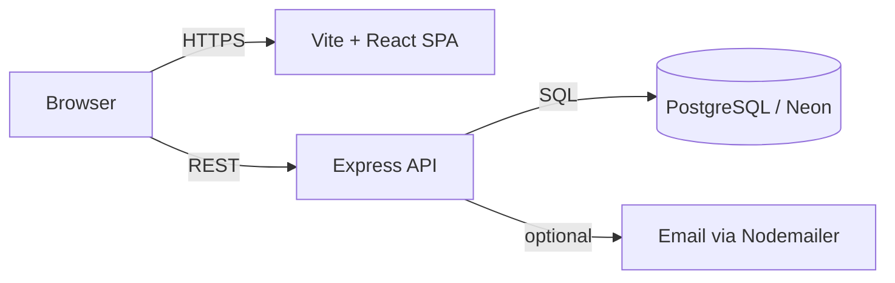

# Tomiwa Aluko — Portfolio


> **Computer Engineering @ UCF** · Minor in Technology Entrepreneurship · Full-stack software & AI integrations

Personal site showcasing projects, experience, and contact—built as a fast **React** SPA with **GSAP** motion, dark/light theme, and an optional **Express + PostgreSQL** API for the guestbook and related features.

## Links

- **Site:** [tomiwaaluko.com](https://tomiwaaluko.com)
- **GitHub:** [@tomiwaaluko](https://github.com/tomiwaaluko)
- **LinkedIn:** [in/olatomiwaaluko](https://www.linkedin.com/in/olatomiwaaluko/)
- **Email:** tomiwaaluko02@gmail.com

## Architecture (this repo)

High-level flow for the full-stack dev setup (`npm run dev:all`):



## Tech stack

### Frontend

- React 18, TypeScript, Vite
- Tailwind CSS, Framer Motion, GSAP (+ ScrollTrigger)
- React Router, Mermaid (project diagrams), PWA support (`vite-plugin-pwa`)

### Backend (`api/`)

- Express, TypeScript
- PostgreSQL (e.g. Neon) for guestbook persistence
- Swagger docs at `/api/docs` when the server is running

## Quick start

```bash
# Frontend only
npm install
npm run dev
# → http://localhost:5173

# Frontend + API (needs API env: DATABASE_URL, email vars as required)
npm install
cd api && npm install && cd ..
npm run dev:all
# Frontend: http://localhost:5173
# API:      http://localhost:5000
```

Copy or create `api/.env` with your database URL and any email credentials the API expects.

## Project structure

```text
/
├── .github/           # CI workflows
├── api/               # Express + TypeScript backend
├── public/            # Static assets (resume, previews, PWA icons)
├── src/
│   ├── components/    # UI sections (Hero, Projects, Timeline, etc.)
│   ├── pages/         # Routes (Home, Projects, Guestbook, …)
│   ├── data/          # Project metadata
│   └── context/       # Theme, audio, and global state
├── Dockerfile
└── compose.yaml
```

---

**[Download resume](./public/previews/resume.pdf)** · **[Engineering / projects](https://tomiwaaluko.com/projects)** (or `/projects` when running locally)
