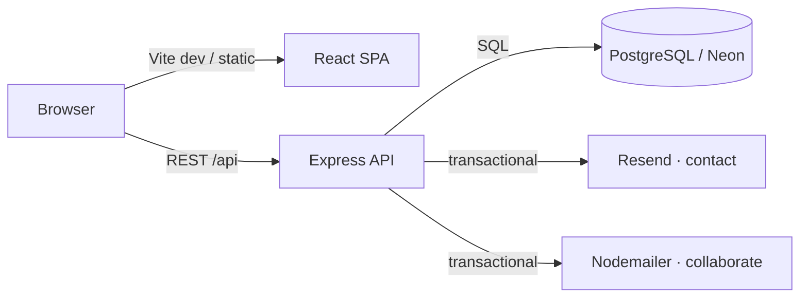

# Tomiwa Aluko — Portfolio


> **Computer Engineering @ UCF** · Minor in Technology Entrepreneurship · Full-stack software and AI integrations

Personal portfolio at [tomiwaaluko.com](https://tomiwaaluko.com): a **React + Vite** SPA with **GSAP** scroll-driven motion, **Lenis** smooth scrolling (synced to GSAP), dark/light theme, optional background music, and a small **Express** API for forms, GitHub card proxies, and optional guestbook data on **PostgreSQL** (e.g. Neon).

## Links

- **Site:** [tomiwaaluko.com](https://tomiwaaluko.com)
- **GitHub:** [@tomiwaaluko](https://github.com/tomiwaaluko)
- **LinkedIn:** [in/olatomiwaaluko](https://www.linkedin.com/in/olatomiwaaluko/)
- **Email:** tomiwaaluko02@gmail.com

## What’s in the app

- **Home (`/`)** — Single-page flow: Hero → About → Timeline → Skills → Projects → DevActivity (GitHub stats) → Contact → Footer, with a first-visit **Loader** and route **page transitions** (GSAP via `TransitionContext`).
- **Projects (`/projects`, `/projects/:id`)** — Engineering index and per-project “blueprint” pages with optional **Mermaid** architecture tabs (`src/data/projectArchitectures.ts`).
- **Services (`/services`)** — Services page with collaboration-style forms wired to the API when deployed.
- **Guestbook** — Backend routes exist under `/api/guestbook`; the **GuestBook** page route is currently commented out in `src/App.tsx` (easy to re-enable).

Contexts: **Theme** (persisted), **Music** (shuffled `public/music/*.mp3` after first user gesture), **Transitions** (animated navigations). **PWA** via `vite-plugin-pwa` (installable, themed manifest).

## Architecture



## Tech stack

| Layer | Details |
|--------|---------|
| **Frontend** | React 18, TypeScript, Vite 8, Tailwind CSS 3, React Router 6 |
| **Motion** | GSAP + ScrollTrigger, Lenis (RAF via `gsap.ticker`), Framer Motion (`AnimatePresence`) |
| **Content / UI** | Mermaid diagrams, Lucide & React Icons, `@splinetool/react-spline`, axios |
| **Backend** | Express 5, TypeScript, `pg`, express-validator, Resend, Nodemailer |
| **Docs** | Swagger UI at `/api/docs` (OpenAPI in `api/swagger.yaml`) |

## Scripts

| Command | Description |
|---------|-------------|
| `npm run dev` | Vite dev server (default **http://localhost:5173**) |
| `npm run build` | Production frontend build |
| `npm run lint` | ESLint |
| `npm run preview` | Preview production build |
| `npm run server` | API only: `cd api && npm run dev` (**port 5000** by default) |
| `npm run dev:all` | Frontend + API with `concurrently` |

API (`api/`): `npm run dev` (ts-node), `npm run build` (tsc → `dist/`), `npm start` (node `dist/index.js`).

## Quick start

```bash
git clone <repo-url>
cd tomiwaalukov3

# Frontend only
npm ci
npm run dev
```

Full stack (contact/collaborate/guestbook and GitHub SVG proxies need env — see below):

```bash
npm ci
cd api && npm ci && cd ..
npm run dev:all
```

- Frontend: **http://localhost:5173**
- API: **http://localhost:5000**

Create **`api/.env`** with the variables your features need (minimum empty file for local API smoke tests; real forms need email/DB keys).

## Environment variables

### Frontend (`.env` — Vite `VITE_*`)

| Variable | Purpose |
|----------|---------|
| `VITE_API_URL` | API base (e.g. `http://localhost:5000/api` in dev). In production, set to your deployed API or a proxied `/api` prefix. |
| `VITE_CONTACT_EMAIL` | Email shown in the UI (falls back if unset). |
| `VITE_GITHUB_TOKEN` | Optional GitHub personal token for higher rate limits when **DevActivity** calls the GitHub REST API. |

### Backend (`api/.env`)

| Variable | Purpose |
|----------|---------|
| `DATABASE_URL` | PostgreSQL (e.g. Neon) — required for guestbook routes. |
| `RESEND_API_KEY`, `RESEND_FROM`, `RESEND_TO` | **POST /api/contact** via Resend (`RESEND_TO` or `EMAIL_TO` for recipient). |
| `EMAIL_USER`, `EMAIL_PASS` | Gmail app password path for **POST /api/collaborate** (Nodemailer). |
| `PORT` | Optional; defaults to **5000**. |

## API overview

| Method | Path | Notes |
|--------|------|--------|
| `GET` | `/api/health`, `/api/hello` | Liveness / sanity |
| `POST` | `/api/contact` | Contact form → Resend |
| `POST` | `/api/collaborate` | Collaboration form → Nodemailer |
| `GET` \| `POST` \| `DELETE` | `/api/guestbook` | Guestbook CRUD (Postgres) |
| `GET` | `/api/profile-views` | Proxy GitHub profile-views badge SVG |
| `GET` | `/api/commit-stats` | Proxy commit-language card SVG |
| `GET` | `/api/docs` | Swagger UI |

## Project structure

```text
.github/workflows/   # CI: frontend + api TypeScript builds (Node 20)
api/                   # Express server (index.ts → dist/)
public/                # Static assets, music, project images, PWA icons, resume
src/
  components/          # Sections (Hero, Timeline, Projects, Contact, …)
  context/             # Theme, Music, Transition
  data/                # projects.ts, projectArchitectures.ts, schemas
  pages/               # Home, Projects, ProjectDetail, Services, GuestBook (optional)
  utils/
```

## Adding or updating portfolio content

1. **New project** — Add an entry in `src/data/projects.ts`, optional Mermaid strings in `src/data/projectArchitectures.ts`, and media under `public/project-images/<id>/`.
2. **Background tracks** — Add `.mp3` under `public/music/` and append the path in `src/context/MusicContext.tsx` (`MUSIC_TRACKS`).

## CI

On push and pull request to **`main`**, GitHub Actions runs **`npm run build`** and **`cd api && npm run build`**. There is no separate automated test job in this repo.

---

**[Resume (PDF)](./public/previews/resume.pdf)** · **[Projects](https://tomiwaaluko.com/projects)** (or `/projects` locally)
